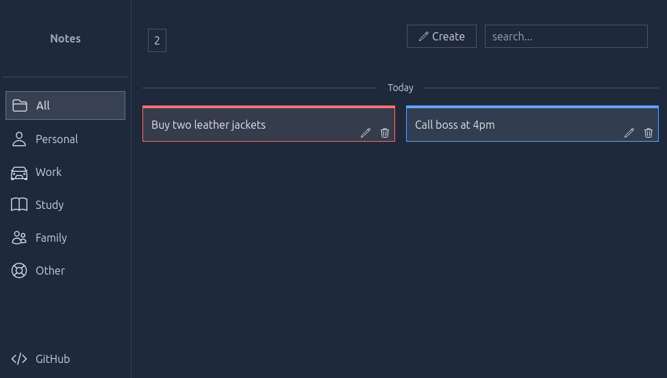
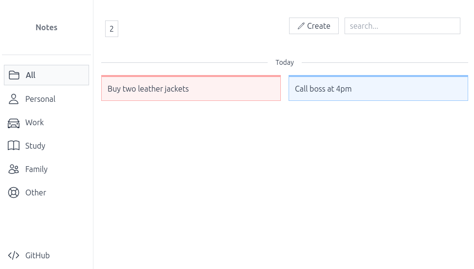
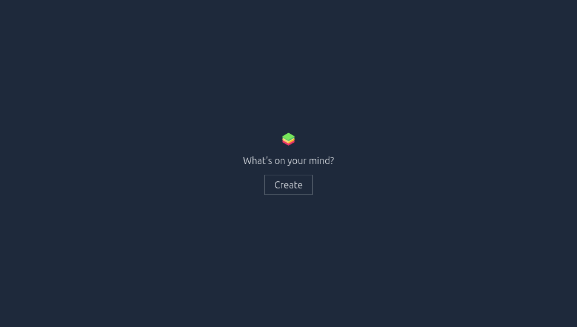
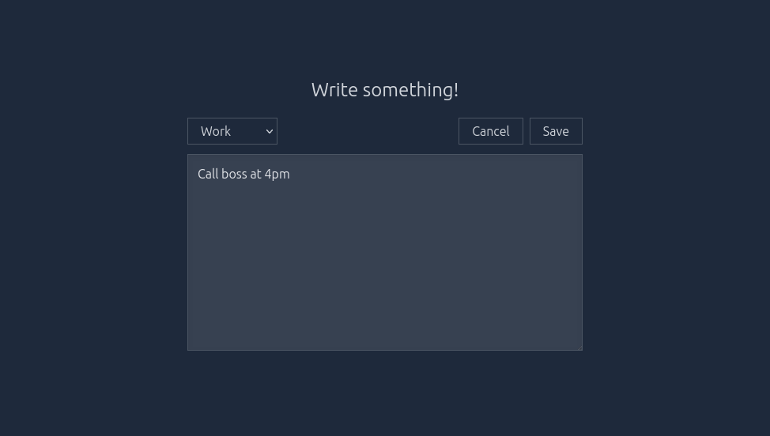
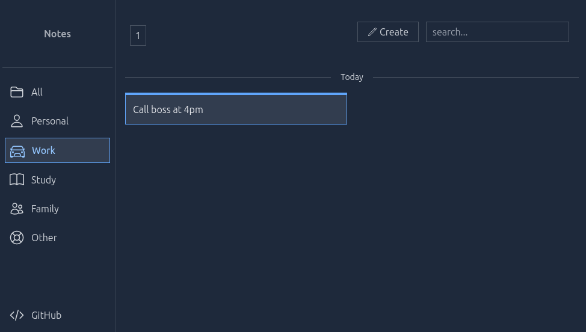
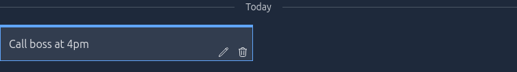

# notes
A simple note taking application with offline support

## overview
While there many todo app implementations, this focuses on simplicity and minimalism to help me note down ideas just in time. 

## features
- Light/Dark theme
- Minimal and fast
- Beginner friendly
- Local storage of notes
- Edit and delete operations

## live demo
Try it yourself: [demo](https://notes-demo-pwa.netlify.app/)

## anatomy 

### intro
Incase you have not used it before or currently have zero notes, this screen is displayed:

### entry form
When you click `Create`, a note entry form is displayed for you to start writing.
Change the category of the note using the select button. `Save` applies the changes made and update the notes in storage.

### dashboard
On load, notes are fetched from storage and rendered in the dashboard. The search bar matched the notes by regexp with case-insenstive and global flags. The total number of notes is displayed in the top left of the header.

### notes
Notes are grouped by date and ordered by timestamp.
Hovering on a note displays the operation buttons: _edit_ and _delete_.

## development
To get started with modifying the code or fixing a bug or implementing a new feature:
- install [node.js](https://nodejs.org) and [npm](https://npmjs.org) or [pnpm](https://pnpm.io)
- install dependencies: `npm install` or `pnpm install`
- run dev server: `npm run dev` or `pnpm dev`
- building for production: `npm run build` or `pnpm build` produces `dist` directory containing deployable files

## credits
- Vite: [Docs](https://vitejs.dev)
- Alpinejs: [Docs](https://alpinejs.dev)
- TailwindCSS: [Docs](https://tailwindcss.com)
- Logo: [Sticky notes icons created by smashingstocks - Flaticon](https://www.flaticon.com/free-icons/sticky-notes)

## license

Released under [MIT License](./LICENSE.txt)

Copyright &copy; 2023 [Henry Hale](https://github.com/henryhale)